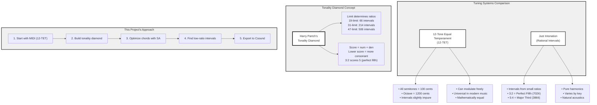
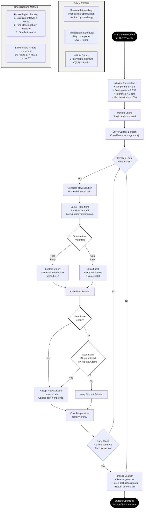
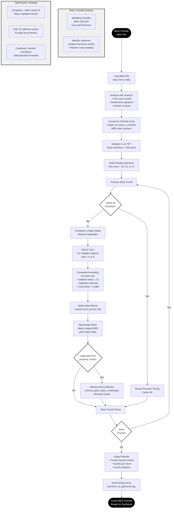
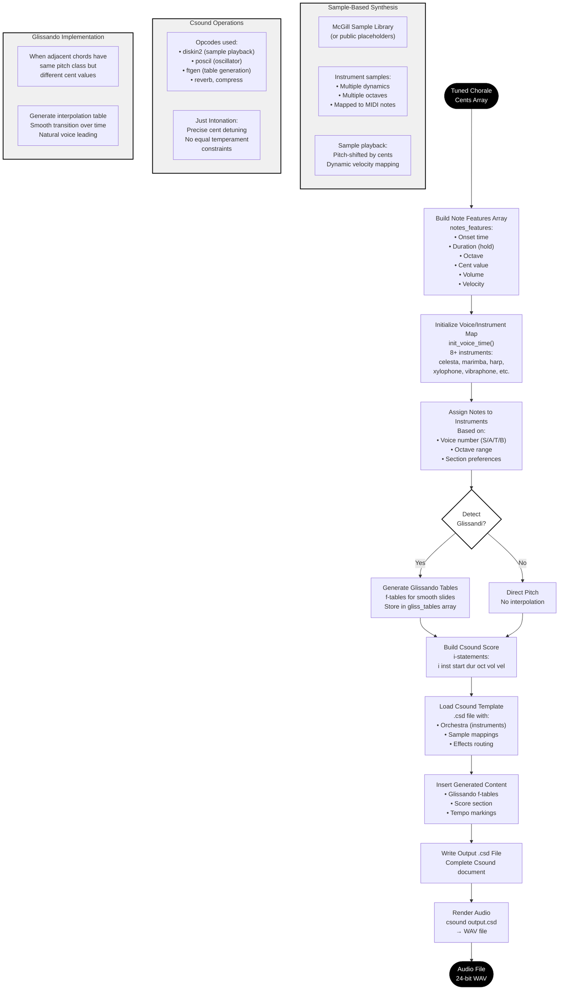
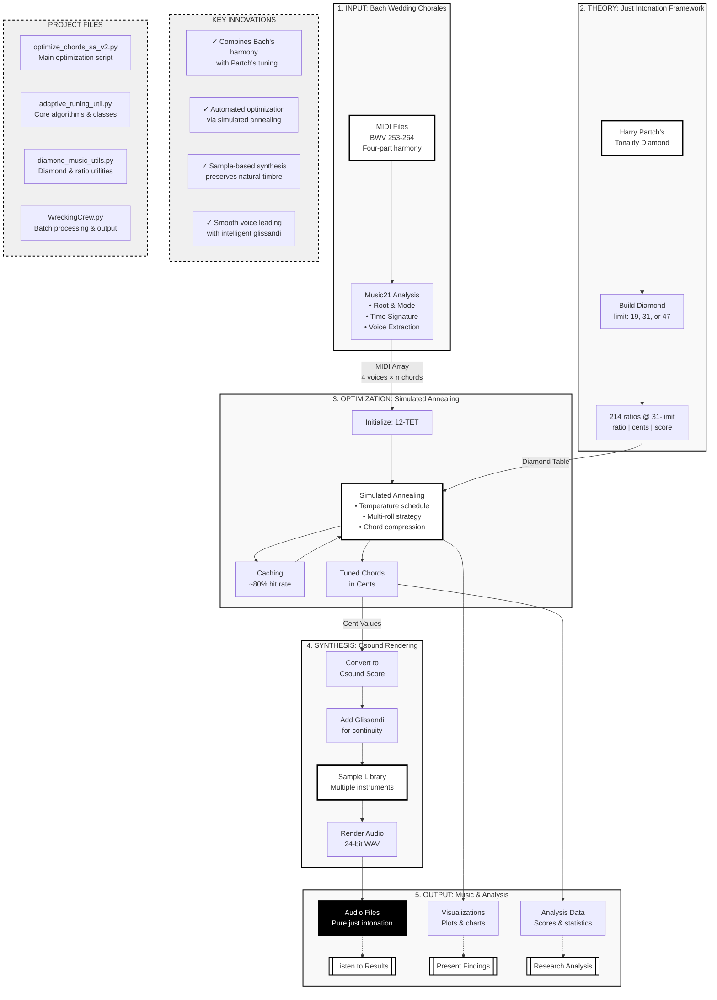

# One-Footed Bride Tuning: Presentation Charts

A comprehensive visual guide to the technology, theory, and implementation of Harry Partch's just intonation system applied to Bach chorales.

**Repository:** https://github.com/prentrodgers/One-footed-bride-tuning

---

## Chart 1: Technology of Tuning

Comparison of equal temperament and just intonation systems, showing how the project bridges modern MIDI with historical tuning theory.

---

## Chart 2: Harry Partch's Tonality Diamond

The mathematical and musical structure of the tonality diamond, showing how ratios are generated and scored.

```mermaid
graph TB
    subgraph Construction["Building the Tonality Diamond"]
        Start["Start: Define Prime Limit<br/>(e.g., 19, 31, or 47)"]
        Start --> Ratios["Generate All Ratios<br/>Otonality (n/1) & Utonality (1/n)"]
        Ratios --> Unique["Remove Duplicates<br/>& Sort by Value"]
        Unique --> Convert["Convert to Cents<br/>cents = 1200 × log₂(ratio)"]
        Convert --> Score["Calculate Consonance Score<br/>score = numerator + denominator"]
    end
    
    subgraph Structure["Harry Partch's Diamond Structure"]
        O["Otonality Series<br/>(Overtone Series)"]
        U["Utonality Series<br/>(Undertone Series)"]
        
        O --> O1["1/1, 3/1, 5/1, 7/1, 9/1..."]
        O --> O2["Multiply: 1×1, 1×3, 1×5..."]
        
        U --> U1["1/1, 1/3, 1/5, 1/7, 1/9..."]
        U --> U2["Divide: 1/1, 1/3, 1/5..."]
        
        O1 -.Cross Product.-> Diamond
        U1 -.Cross Product.-> Diamond
    end
    
    subgraph Example["Example: 11-Limit Diamond"]
        L11["Primes: 1, 3, 5, 7, 9, 11"]
        L11 --> Ex1["Ratios include:<br/>3/2 (702¢) - Perfect 5th<br/>5/4 (386¢) - Major 3rd<br/>7/4 (969¢) - Harmonic 7th<br/>11/8 (551¢) - Neutral 4th"]
        Ex1 --> Ex2["Total intervals in 11-limit:<br/>~36 unique ratios"]
    end
    
    subgraph ProjectImpl["Implementation in Project"]
        Build["build_tonal_diamond()<br/>adaptive_tuning_util.py"]
        Build --> Array["Returns numpy array:<br/>[ratio, cents, limit_score]"]
        Array --> Usage["Used by:<br/>• ChordScorer<br/>• LowNumberRatioIntervals<br/>• Simulated Annealing"]
    end
    
    Diamond["Diamond Matrix<br/>All Interval Combinations"]
    Diamond --> Store["Store as:<br/>ratio | cents | score"]
    
    style Start fill:#fff,stroke:#000,stroke-width:3px
    style Diamond fill:#fff,stroke:#000,stroke-width:3px
    style Build fill:#fff,stroke:#000,stroke-width:3px
    style Construction fill:#f0f0f0,stroke:#000,stroke-width:2px
    style Structure fill:#f0f0f0,stroke:#000,stroke-width:2px
    style Example fill:#f0f0f0,stroke:#000,stroke-width:2px
    style ProjectImpl fill:#f0f0f0,stroke:#000,stroke-width:2px
```

---

## Chart 3: Simulated Annealing Optimization

The core algorithm that finds optimal tunings for 4-note chords using temperature-based probabilistic search.

---

## Chart 4: Bach Chorale Harmony & Tuning

The complete process for analyzing and retuning Bach's four-part chorales using just intonation.

---

## Chart 5: Csound Sample-Based Synthesis

The audio rendering pipeline that converts tuned chords into high-quality WAV files using sample libraries.

---

## Chart 6: Complete Workflow Overview

The end-to-end system showing how all components work together to create just intonation music from MIDI sources.

---

## Presentation Notes

### Key Talking Points

1. **Why Just Intonation?**
   - Pure harmonic intervals create more consonant chords
   - Historical tuning systems reveal new musical possibilities
   - Bach's harmonies sound even more beautiful with rational intervals

2. **Harry Partch's Contribution**
   - Systematic approach to organizing microtonal ratios
   - Tonality diamond provides complete interval palette
   - Score system (num + den) quantifies consonance

3. **Simulated Annealing Innovation**
   - Automated optimization of complex tuning problems
   - Temperature schedule balances exploration and exploitation
   - Multi-roll strategy escapes local minima

4. **Bach Chorale Selection**
   - Wedding chorales (BWV 253-264) are harmonically rich
   - Four-part structure ideal for demonstrating intervals
   - Repeated chords enable efficient caching

5. **Csound Synthesis Quality**
   - Sample-based approach preserves natural instrument timbre
   - Precise cent control enables pure just intonation
   - Glissando smoothing maintains voice leading integrity

6. **Measurable Results**
   - ~80% cache hit rate demonstrates efficiency
   - Lower scores indicate more consonant harmonies
   - Audio files demonstrate perceptible improvement

### Usage

This document can be:
- Viewed directly in GitHub (which renders Mermaid diagrams)
- Exported to PDF for presentations
- Used in VS Code with Mermaid preview extensions
- Converted to slides using tools like Marp or reveal.js

### Contact

For questions about this presentation or the One-Footed Bride Tuning project:
- Repository: https://github.com/prentrodgers/One-footed-bride-tuning
- Created: February 2026
