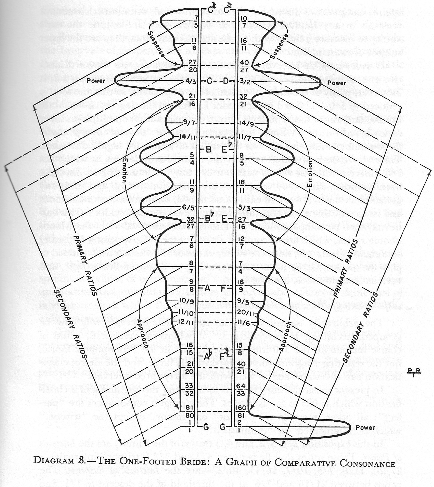

# One-footed-bride-tuning

A compact implementation of Harry Partch's "One-Footed Bride" tonality diamond tuning, applied to Bach chorales — and then played, and then filmed.
<br>
<a href="one-footed-bride-pic.jpeg"></a>

## Overview

Bach's four-part chorales are written for a keyboard that cannot play them in tune. This project retunes each chord to the nearest set of low-number rational intervals, chord by chord, and then renders the result as audio and as video.

Three stages, each usable on its own:

1. **Tune** — pick cent values for every chord that favour small-numbered ratios, using a tonality diamond, simulated annealing, and a Viterbi pass that keeps adjacent chords from lurching. `Straw_man_tuning_v2.py`
2. **Play** — turn tuned cent arrays into a Csound score across an eight-section orchestra. `WreckingCrew.py`, or `midi_tuning_server.py` for live MIDI.
3. **Show** — build that same orchestra in Blender, driven by the same note data, so the instruments move with what you hear. `blender_stage.py`

The tuning is the point; the rest exists so you can hear and see whether it worked.

## A walkthrough

Six commands, from a first rough tuning to a finished audio render. Output shown is real.

**1. The tuning algorithm at its most basic.**

```bash
python Straw_man_tuning_v2.py --tolerance 1 --chorale_list bwv255 \
    --numpy_dir numpy-test --no-print_values
```
```
mean: 398.7,  median: 127.5,  min: 43.0,  max: 5135.0,  argmax: 12,
deciles: [ 43.  59.  73.8  97.  120.  127.5  135.  157.  184.  1121. ]
```

Lower scores are better: a score of 43 is a chord sitting on clean ratios. The mean of 398.7 and that 5135 maximum say most chords found something and a few did not.

**2. Report on what it did.**

```bash
python chord_report.py --input_numpy_file numpy-test/bwv255-opt.npy
```
```
bwv255  bwv255-opt.npy
/home/prent/Repos/One-footed-bride-tuning/numpy-test
tolerance: 1, limit_max: 17, tonal diamond: (66, 3), chords: 128
Average score: 1228.1, max score: 5056.0, max chord: 12
Key: G♮ major
```

Chord 12 is the problem. `chord_report.py` prints every chord's intervals as ratios and cents, so you can see which voice is stranded.

**3. Try harder: aggressive annealing plus the Viterbi pass.**

```bash
python Straw_man_tuning_v2.py \
    --no-print_values --no-print_finals --no-print_initial \
    --rolls 4 --workers 1 --runs 1 \
    --limit_max 17 \
    --chorale_list bwv255 \
    --ratio_factor 1.25 \
    --tolerance 1 \
    --max_delta 35 \
    --numpy_dir numpy-test \
    --max_gap 25 --retune_on_gaps 5 \
    --no-keep_previous \
    --sa_iterations 1000 \
    --cooling_rate 0.999 \
    --initial_temp 3.5 \
    --spread 7 \
    --use_viterbi \
    --k_candidates 15 \
    --viterbi_vertical_weight 1.0 \
    --viterbi_verbose \
    --viterbi_verbose_threshold 80 \
    --detect_phrases \
    --phrase_horizontal_weight 8.0 \
    --viterbi_workers 4
```
```
mean: 50.8,  median: 43.0,  min: 43.0,  max: 82.0,  argmax: 42,
deciles: [43.  43.  43.  43.  43.  43.  45.  60.  62.8  67. ]
```

**4. Check it again.**

```bash
python chord_report.py --input_numpy_file numpy-test/bwv255-opt.npy
```
```
Average score: 50.8, max score: 82.0, max chord: 42
Key: G♮ major
```

A mean of 50.8 against 1228.1, and the worst chord down from 5056 to 82. It takes considerably longer and it is worth it. Most of the gain is the Viterbi pass: simulated annealing tunes each chord in isolation, and Viterbi then picks the path through those candidates that also keeps voices from jumping between chords.

**5. Sweep the whole set.** Twelve of Bach's wedding chorales, across tolerances, ratio factors and diamond limits. This takes hours.

```bash
./grid_search.sh
```

With a Kubernetes cluster, the same sweep as batch jobs (see [README-k8s-grid-search.md](README-k8s-grid-search.md)):

```bash
./generate-grid-search-jobs.sh   # write the job manifests
./deploy-grid-search-jobs.sh     # run them
```

Then pick the winners:

```bash
CHORALES=${1:-$(echo bwv{253..264})}
python select_best_and_render.py --numpy_dir_root Archive/straw-man \
    --chorale_list $CHORALES --suffix="-opt.npy" --sort_by p90 \
    --copy_npy_to Archive/straw-man/viterbi-tunings-8-25
```

**6. Listen.** Needs Csound.

```bash
python WreckingCrew.py --numpy_dir numpy-test --chorale_list bwv255 \
    --cent_file_partial=-opt.npy --short_repeats
```

## Tuning

### Straw_man_tuning_v2.py
The tuner. Enumerates candidate ratios from a tonality diamond, searches per-chord tunings by permutation, roll and simulated annealing, and optionally runs a Viterbi pass over the candidates to minimise movement between adjacent chords. Writes one `.npy` of cent values per chorale.

The flags that matter most: `--limit_max`, `--tolerance`, `--ratio_factor`, `--spread`, `--max_delta` for what counts as in tune; `--sa_iterations`, `--cooling_rate`, `--initial_temp` for how hard annealing tries; `--use_viterbi`, `--k_candidates`, `--viterbi_vertical_weight`, `--detect_phrases`, `--phrase_horizontal_weight` for the path through them.

### chord_report.py
Prints a tuned array as music: every chord's intervals as ratios and cents, its score, and the chorale's key. The fastest way to find which chord went wrong.

### viterbi_optimization.py
The trellis used by `--use_viterbi`. A library, not a command — see [VITERBI_OPTIMIZATION_GUIDE.md](VITERBI_OPTIMIZATION_GUIDE.md).

### horizontal_transpose.py
Post-pass for horizontal consistency: where adjacent chords share pitch classes, reuse the earlier cent value so the pitch does not drift across the chorale.

```bash
python horizontal_transpose.py Archive/straw-man/bwv253-opt.npy \
  --destination Archive/straw-man/bwv253-trans-sa-opt.npy --log-level DEBUG
```

### select_best_and_render.py
Ranks directories of tuned arrays and optionally renders the winners. `--sort_by` takes `score`, `gapsum`, `maxgap`, `p90`, `over20` or `name`. Ranking by `maxgap` or `p90` rather than mean score reflects what is actually audible: one big lurch is worse than a slightly higher average.

Other arguments: `--copy_npy_to`, `--copy_mp3_to`, `--render`, `--album`, `--bass_sustain`, `--spread_render`, `--short_repeats`, `--top_gaps`, `--detail_dirs`.

### analyze_spread.py, analyze_adjacent_spread.py, analyze_verdicts.py
Census tools over batches of tuned arrays — pitch-class spread, adjacent-chord gaps, and how often the ratchet accepted a new tuning across a grid-search run.

## Sound

### WreckingCrew.py
The rendering engine. Turns tuned cent arrays into a Csound `.csd` across the eight sections — marimba, finger pianos, bass, pizzicato strings, bowed strings, woodwinds, brass and melody — handling density masks, octave stretch, bass sustain, repeats and glissando smoothing between chords.

```bash
python WreckingCrew.py --numpy_dir Archive/straw-man/viterbi-tunings-8-25 \
    --chorale_list bwv256 --auto_density --album 5 --mod d
```

### midi_tuning_server.py
Live MIDI to Csound. Reads a keyboard, tunes each chord as it arrives, orchestrates it across those same sections, and sends score events to Csound. A browser UI over WebSocket controls tuning parameters, instrument assignment, density, octave stretch and envelopes while you play.

```bash
python midi_tuning_server.py     # then open http://localhost:8000
```

### train.py
Hyperparameter evaluator for the SA tuner: runs test chords with a given parameter set and reports scores and timing as JSON. `--animate` writes a GIF of the annealing converging.

```bash
python train.py '{"ratio_factor": 4.0, "rolls": 5}'
python train.py --animate '{"max_iterations": 200}'
```

## Vision

The same note data that drives Csound also drives a Blender orchestra, so what you see is what you hear — the marimba bar that lights is the pitch that sounds.

### blender_stage.py
Builds all nine sections on one stage, animates them from a features `.npy`, and renders frames. Camera work comes from a cue sheet: hand-authored shots in `CAMERA_CUES`, or shots generated into `CAMERA_AUTOGEN` ranges, which are gated on the volume data so the camera never cuts to an instrument that is not sounding.

```bash
# static still, to check the layout
blender --background --python blender_stage.py -- --out stage_proto.png

# the full animation
blender --background --python blender_stage.py -- \
    --npy Uploads/<stem>.npy --tempo 104 --duration 281.7 \
    --res-x 1280 --res-y 720 --out stage_frames

# then mux
ffmpeg -y -framerate 30 -i stage_frames/frame_%06d.png -i Uploads/<stem>.mp3 \
    -c:v libx264 -pix_fmt yuv420p -c:a aac -shortest out.mp4
```

Useful flags: `--list-targets` (every name the cue sheet may address), `--dump-activity` (who plays when, for `plot_activity.py`), `--dump-layout`, `--frame-start/--frame-end` (split a render).

### The section modules
`blender_marimba_poc.py`, `blender_bass_section_poc.py`, `blender_finger_piano_poc.py`, `blender_woodwind_poc.py`, `blender_brass_poc.py`, `blender_bowed_strings_poc.py`, `blender_pizzicato_poc.py`, `blender_melody_poc.py`, `blender_conductor_poc.py`.

Each builds and animates one section and runs standalone for a smoke render. Every instrument shows its pitch, not merely that it is sounding: marimba bars flex and flash where they are struck, tine racks bend the plucked tine, woodwinds cover nine tone holes (all nine is C, half a hole per semitone), brass presses pistons, and the trombone runs its slide out. Pitch mapping is continuous in cents, so a note between two semitones sits between two positions — which is the whole subject of the project made visible.

`pitch_bucket.py` folds any performed pitch onto one of the fixed positions those instruments have.

### stage_preview.html and stage_layout.json
`--dump-layout` writes every camera target's box, the camera, the light rig and the resolved cue sheet to `stage_layout.json`; `stage_preview.html` draws it in three.js so the layout can be tuned without rendering. `stage_layout_editor.html` writes the `SECTIONS` block back out.

### render_farm.sh
Splits one render across every GPU in the cluster — two Arc Pro B70s, two B580s and a B50 — as one pod per GPU, all writing into the same directory. No merge step is needed: the animation is procedural, so frame N is at t = N/FPS whoever renders it.

```bash
./render_farm.sh --npy Uploads/<stem>.npy --tempo 104 --duration 281.7 --out frames
./render_farm.sh --progress
./render_farm.sh --stop
```

8,451 frames took 57 minutes across five GPUs against 4h15m on one. The cards land within 30% of each other, which says the render is paced by the per-frame Python rather than by the GPU.

### comfy_restyle.py and stage_boxes.py (experimental)
An attempt to add photoreal texture by passing rendered frames through ComfyUI's SDXL img2img at low denoise. `stage_boxes.py` projects each section's box through the render camera so each region of the frame can be told what instrument it holds — without that, the diffusion model reads the marimba as a piano. A ControlNet holds the geometry. It works on stills; whether frames flicker against each other across a whole shot is still an open question.

## Helper modules

### adaptive_tuning_util.py
The core library: chorale loading (MIDI, music21 corpus, numpy), tonality diamond construction and scoring (`ChordScorer`, `LowNumberRatioIntervals`), modular cent arithmetic, chord rearrangement and perturbation, and the glide/density/octave machinery the renderer needs.

### diamond_music_utils.py
Ratio construction, scale building, cent/ratio conversion, chord and glissando generation, Csound file I/O.

## Notebooks

- **Straw_man_tuning.ipynb** — the greedy, non-SA algorithm, for understanding the core idea and for live-performance latency tests.
- **compare_horizontal_chords.ipynb** — chords before and after `horizontal_transpose.py`.
- **Chorale-info.ipynb** — per-pitch-class spread and score statistics over a tuned array.

## Quick start

**Prerequisites:** Python 3.10+, numpy, scipy, matplotlib; Csound for audio; Blender 4.2+ for video; sox and ffmpeg for muxing.

```bash
mamba create -n csound python jupyterlab matplotlib numpy scipy music21
mamba activate csound
pip install -r requirements.txt

# tune one chorale (walkthrough step 1)
python Straw_man_tuning_v2.py --tolerance 1 --chorale_list bwv255 \
    --numpy_dir numpy-test --no-print_values

# see what it did
python chord_report.py --input_numpy_file numpy-test/bwv255-opt.npy

# hear it
python WreckingCrew.py --numpy_dir numpy-test --chorale_list bwv255 \
    --cent_file_partial=-opt.npy --short_repeats
```

## Key parameters

| parameter | what it controls |
|---|---|
| `limit_max` | tonality diamond limit — largest numerator/denominator in candidate ratios. 17, 19, 23 are the usual values. |
| `tolerance` | how many cents from an exact ratio still counts as that ratio [1–4] |
| `ratio_factor` | weight favouring lower-number ratios; higher is more consonant and less flexible |
| `spread` | Gaussian σ for per-roll perturbation (default 7) |
| `max_delta` | furthest a candidate may sit from 12-TET, in cents (default 33) |
| `max_gap` / `retune_on_gaps` | how big a jump between adjacent chords is tolerated before retuning |
| `k_candidates` | how many per-chord tunings the Viterbi pass gets to choose between |
| `phrase_horizontal_weight` | how hard Viterbi works to keep a phrase's pitches stable |

## Contributing & License

Issues and pull requests welcome. Apache 2.0 — see [LICENSE](LICENSE).
